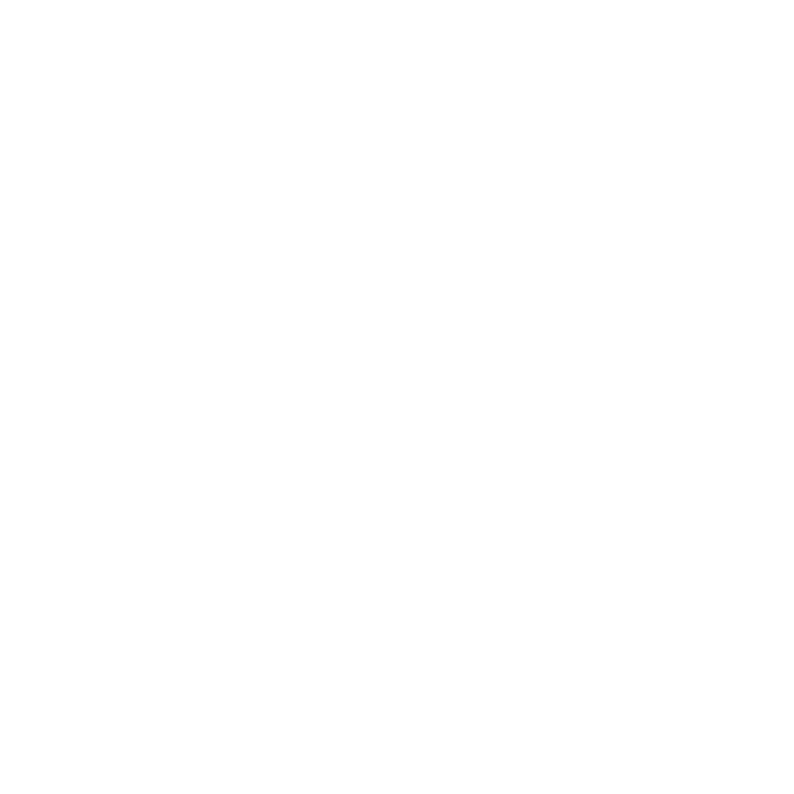
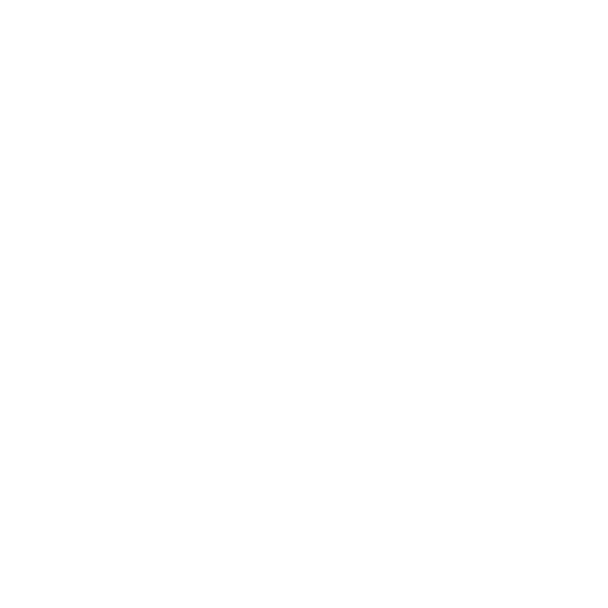
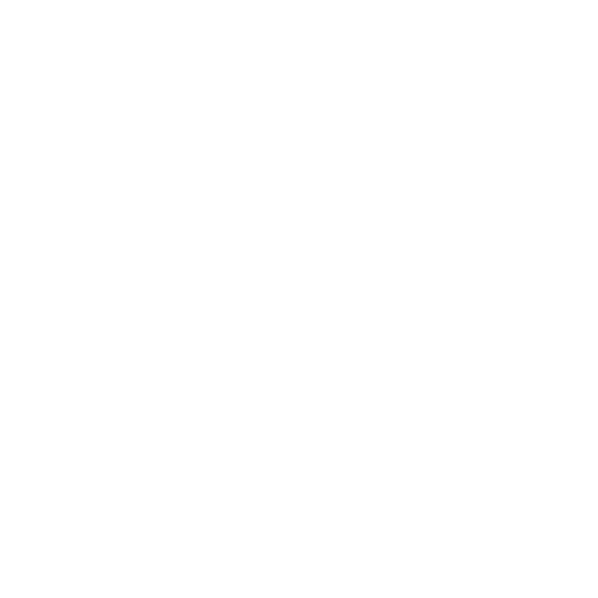
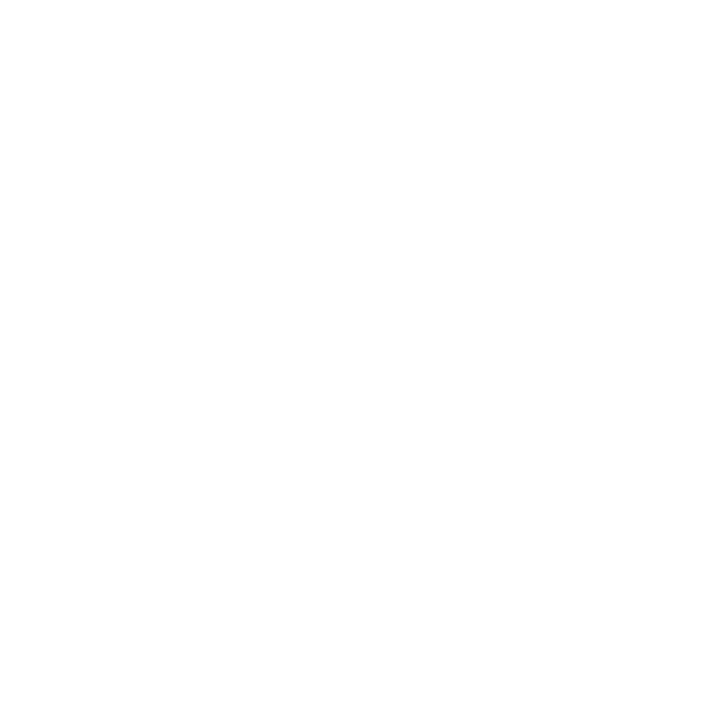

# ESMF Logo

This page specifies the intended use of the ESMF logo. Find descriptions, guidance, and source files as well as further artifacts based on the ESMF logo, such as QR codes.

## Table of contents
  
- [ESMF Logo](#esmf-logo)
  - [Table of contents](#table-of-contents)
  - [Foundational principles](#foundational-principles)
    - [Icon parts](#icon-parts)
    - [Colors](#colors)
    - [Typography](#typography)
  - [Source files for different use cases](#source-files-for-different-use-cases)
    - [Icon only](#icon-only)
    - [Full logo](#full-logo)
      - [Landscape](#landscape)
      - [Portrait](#portrait)
  - [Favicon](#favicon)
  - [QR code](#qr-code)
  - [Downloads](#downloads)

## Foundational principles

The ESMF logo is a combination of a visual element, the ESMF icon, and text.

### Icon parts

The ESMF icon consists of four independent parts. Each one carries a different meaning and a different color. These four elements represent the process steps during the usage of the ESMF framework around the orange Eclipse open-source core.

### Colors

The following colors are used:

| Scope        | Color sample                                                    | Hex value | What the color stands for |
|--------------|-----------------------------------------------------------------|-----------|----------|
| Consumption  |  | #995FAB   | API Consumption in UI & backend – for example, the consumption of all required APIs in one UI, providing a user-friendly, semantics-aware software.|
| Provisioning |    | #8298E0   | The API provisioning (or: implementation) phase where at least one API is provided per Aspect Model to make semantic information available in a modular way. Also suitable for microservice-style software solutions.|
| Modeling    |   | #8DA5BF   | The modeling phase where raw data is explained by creating Aspect Models.|
| Eclipse OSS  |          | #F88D2B   | SAMM, the Semantic Aspect Meta Model at the heart of the ESMF tools and the ESMF project at Eclipse. SAMM specifies how to express the meaning of data through Aspect Models in both a human- and machine-readable way.|

### Typography

The ESMF logo is a combination of the ESMF icon and the font "Roboto".

Download the font directly at: [Google fonts - Roboto](https://fonts.google.com/specimen/Roboto).

Roboto emphasizes on the strong connection between ESMF and the Eclipse Foundation and to determine the open-source core of ESMF.

Roboto is used in two different typefaces:

| Name                 | Typography sample                                            |
|----------------------|--------------------------------------------------------------|
| Roboto – Regular 400 |  |
| Roboto – Bold 700    |        |

## Source files for different use cases

The icon and the logo are prepared for different applications and types of usage.

### Icon only

| Name                 | Preferred usage                       | SVG                                              | PNG                                          |
|----------------------|---------------------------------------|--------------------------------------------------|----------------------------------------------|
| ESMF icon – color    | For use on white or black backgrounds |  |  |
| ESMF icon – white    | For use on black or dark backgrounds  |  |  |
| ESMF icon – black    | For use on white or light backgrounds |  |  |
| ESMF icon – gray     | For use on white or black backgrounds |    |    |

### Full logo

The logo can be used in different surroundings and geometries. Therefore, two different versions are designed to meet different geometrical needs.

#### Landscape

| Name                           | Preferred usage                       | SVG                                                                            | PNG                                                                        |
|--------------------------------|---------------------------------------|--------------------------------------------------------------------------------|----------------------------------------------------------------------------|
| ESMF logo landscape – color    | For use on white or black backgrounds |  |  |
| ESMF logo landscape – white    | For use on black or dark backgrounds  |  |  |
| ESMF logo landscape – black    | For use on white or light backgrounds |  |  |
| ESMF logo landscape – gray     | For use on white or black backgrounds |    |    |

#### Portrait

| Name                         | Preferred usage                       | SVG                                                                          | PNG                                                                      |
|------------------------------|---------------------------------------|------------------------------------------------------------------------------|--------------------------------------------------------------------------|
| ESMF logo portrait – color   | For use on white or black backgrounds |  |  |
| ESMF logo portrait – white   | For use on black or dark backgrounds  |  |  |
| ESMF logo portrait – black   | For use on white or light backgrounds |  |  |
| ESMF logo portrait – gray    | For use on white or black backgrounds |    |   |

## Favicon

For implementing the favicon on any web source please find the necessary files in the [favicon_package_v0.16.zip](favicon_package_v0.16.zip "download") folder (generated with [realfavicongenerator](https://realfavicongenerator.net/)).

The favicon files need to be transferred to the root folder of your web source.
Simply integrate the following HTML lines to the header of your page:

                <link rel="apple-touch-icon" sizes="180x180" href="{{{uiRootPath}}}/img/apple-touch-icon.png">
                <link rel="icon" type="image/png" sizes="32x32" href="{{{uiRootPath}}}/img/favicon-32x32.png">
                <link rel="icon" type="image/png" sizes="16x16" href="{{{uiRootPath}}}/img/favicon-16x16.png">
                <link rel="icon" type="image/x-icon" href="{{{uiRootPath}}}/img/favicon.ico">
                <link rel="manifest" href="{{{uiRootPath}}}/img/site.webmanifest">
                <link rel="mask-icon" href="{{{uiRootPath}}}/img/safari-pinned-tab.svg" color="#5bbad5">
                <meta name="msapplication-TileColor" content="#da532c">
                <meta name="theme-color" content="#ffffff">

## QR code

The following QR codes lead to the [ESMF Eclipse project page](https://projects.eclipse.org/projects/dt.esmf).

| Name                                | Preferred usage                        | SVG                                                                                         | PNG                                                                      |
|-------------------------------------|----------------------------------------|---------------------------------------------------------------------------------------------|--------------------------------------------------------------------------|
| ESMF QR code with icon color        | For use on white or light backgrounds |            |  |
| ESMF QR code with icon & name color | For use on white or light backgrounds |  |  |
| ESMF QR code with icon black        | For use on white or light backgrounds  |            |  |
| ESMF QR code with icon white        | For use on black or dark backgrounds  |            |  |
| ESMF QR code with icon & name black | For use on white or light backgrounds  |  |  |
| ESMF QR code with icon & name white | For use on black or dark backgrounds  |  |  |

## Downloads

- All logo image files are also contained in zipped folder [2023_ESMF_Logo_V1.1.zip](2023_ESMF_Logo_V1.1.zip "download all logos").
- All QR code image files are also contained in zipped folder [ESMF_QR-code_V1.1.zip](ESMF_QR-code_V1.1.zip "download all QR codes").
