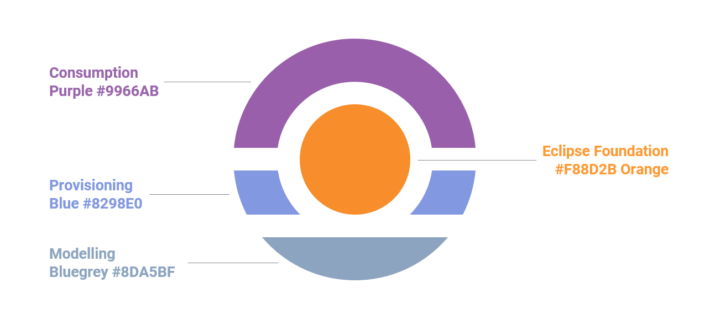
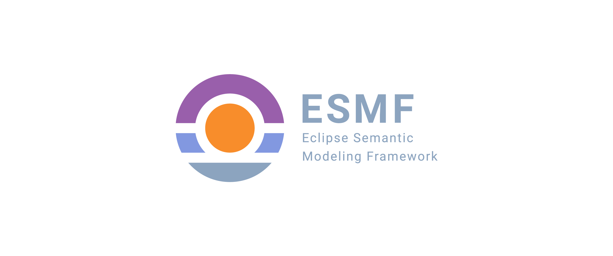
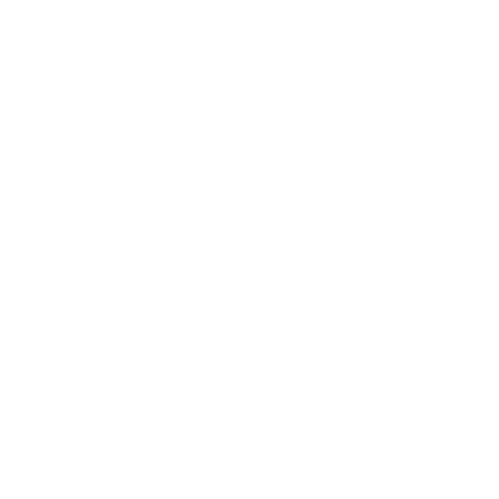
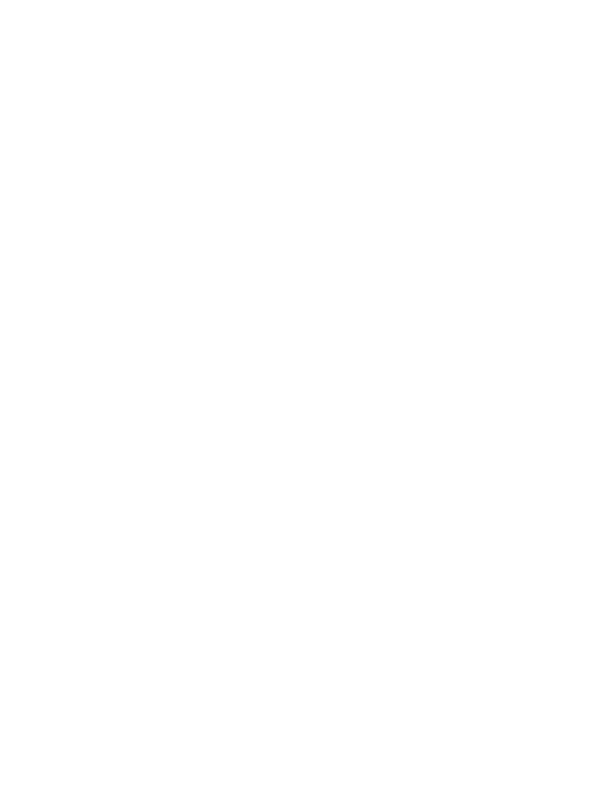
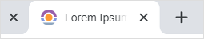
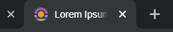

# ESMF Logo

## Table of content
  
1. [Foundational principles](#foundational-principles)
    1. [Icon parts](#icon-parts)
    2. [Color](#color)
    3. [Typography](#typography)
2. [Icon variants](#variants)
3. [Logo with typography](#logo-with-typography)
   1. [Landscape](#landscape)
   2. [Portrait](#portrait)
4. [Favicon](#favicon)
5. [Downloads](#downloads)

## Foundational Principles

### Icon parts

The ESMF-icon consists of four independent parts. Each one with a different meaning and a different color. These four elements represent the process steps during the usage of the ESMF framework around the orange Eclipse Open-Source core.

### Color

The following colors are used:

| Scope        | Color sample                                                    | Hex value | Description  |
|--------------|-----------------------------------------------------------------|-----------|----------|
| Consumption  |  | #995FAB   | API Consumption in UI & backend - the consumption of all required APIs in one UI to provide a customer friendly semantics aware software|
| Provisioning |    | #8298E0   | API Provisioning	- provisioning/implementation phase where (at least) one API is provided per Aspect Model to make semantic information available in a modular way - also suitable for microservice style software solutions|
| Modeling    |  | #8DA5BF   | Modeling - modeling phase where raw data (from the south side) is explained and turned into Aspect Models|
| Eclipse OSS  |          | #F88D2B   | SAMM	- depicts SAMM like a sun – SAMM as the meta model which is at its heart and formally how to express the meaning of data in Aspect Models|

### Typography

The ESMF logo is a combination of the ESMF icon and the font "Roboto".

Download the font directly at: [Google fonts - Roboto](https://fonts.google.com/specimen/Roboto).

Roboto emphasizes on the strong connection between ESMF and the Eclipse Foundation 
and to determine the Open-Source core of ESMF. 

Roboto is used in two different typefaces:

| Name                 | Typography sample                                            |
|----------------------|--------------------------------------------------------------|
| Roboto - Regular 400 |  |
| Roboto - Bold 700    |        |

## Variants

The icon and the logo are prepared for different applications and types of usage.

### Icon

| Name                                                            | Preferred usage                             | SVG                                              | PNG                                          |
|-----------------------------------------------------------------|---------------------------------------------|--------------------------------------------------|----------------------------------------------|
| ESMF Icon - color                                               | To be used on white and black surfaces      |  |  |
| ESMF Icon - white   | To be used on black and dark grey surfaces  |  |  |
| ESMF Icon - black                                               | To be used on white and light grey surfaces |  |  |
| ESMF Icon - grey                                                | To be used on white and black surfaces      |    |    |

## Logo with typography

The logo can be used in different surroundings and geometries. Therefore, two different versions are layouted to meet different geometrical needs.

### Landscape

| Name                                                            | Preferred usage                             | SVG                                                                            | PNG                                                                        |
|-----------------------------------------------------------------|---------------------------------------------|--------------------------------------------------------------------------------|----------------------------------------------------------------------------|
| ESMF Icon - color                                               | To be used on white and black surfaces      |  |  |
| ESMF Icon - white | To be used on black and dark grey surfaces  |  |  |
| ESMF Icon - black                                               | To be used on white and light grey surfaces |  |  |
| ESMF Icon - grey                                                | To be used on white and black surfaces      |    |    |

### Portrait

| Name                                                                     | Preferred usage                             | SVG                                                                          | PNG                                                                      |
|--------------------------------------------------------------------------|---------------------------------------------|------------------------------------------------------------------------------|--------------------------------------------------------------------------|
| ESMF logo portrait - color                                               | To be used on white and black surfaces      |  |  |
| ESMF logo portrait - white | To be used on black and dark grey surfaces  |  |  |
| ESMF logo portrait - black                                               | To be used on white and light grey surfaces |  |  |
| ESMF logo portrait - grey                                                | To be used on white and black surfaces      |    |   |

## Favicon
 

For implementing the favicon on any web source please find the necessary files in the [favicon_package_v0.16.zip](favicon_package_v0.16.zip "download") folder (generated with [realfavicongenerator](https://realfavicongenerator.net/)).

The favicon files need to be transferred to the root folder of your web source. 
Simply integrate the following html lines to the header of your page:

                <link rel="apple-touch-icon" sizes="180x180" href="{{{uiRootPath}}}/img/apple-touch-icon.png">
                <link rel="icon" type="image/png" sizes="32x32" href="{{{uiRootPath}}}/img/favicon-32x32.png">
                <link rel="icon" type="image/png" sizes="16x16" href="{{{uiRootPath}}}/img/favicon-16x16.png">
                <link rel="icon" type="image/x-icon" href="{{{uiRootPath}}}/img/favicon.ico">
                <link rel="manifest" href="{{{uiRootPath}}}/img/site.webmanifest">
                <link rel="mask-icon" href="{{{uiRootPath}}}/img/safari-pinned-tab.svg" color="#5bbad5">
                <meta name="msapplication-TileColor" content="#da532c">
                <meta name="theme-color" content="#ffffff">

## Downloads

All image files are contained in zipped folder [2023_ESMF_Logo_V1.1.zip](2023_ESMF_Logo_V1.1.zip "download").
